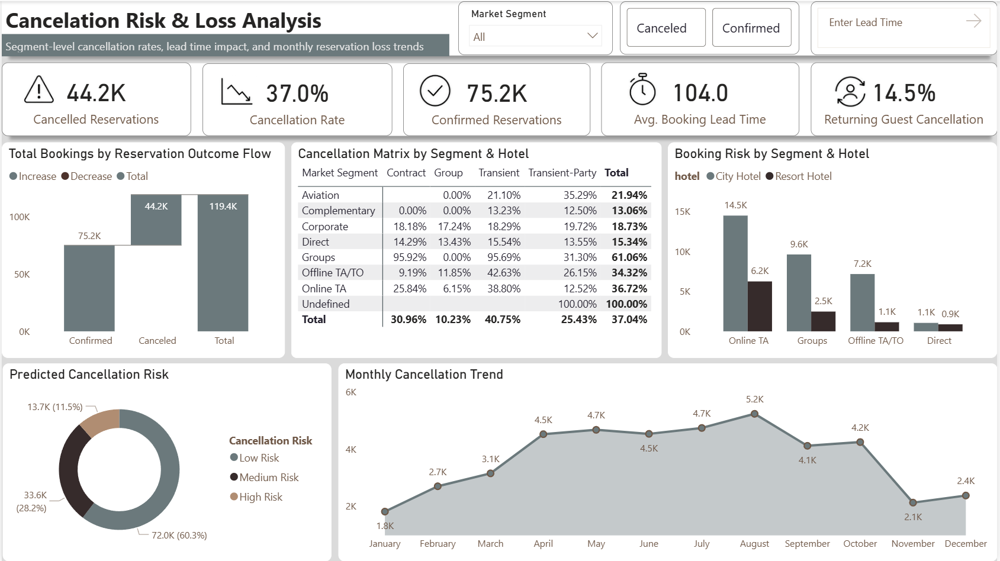
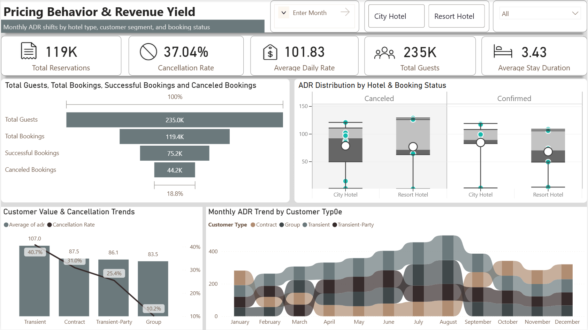
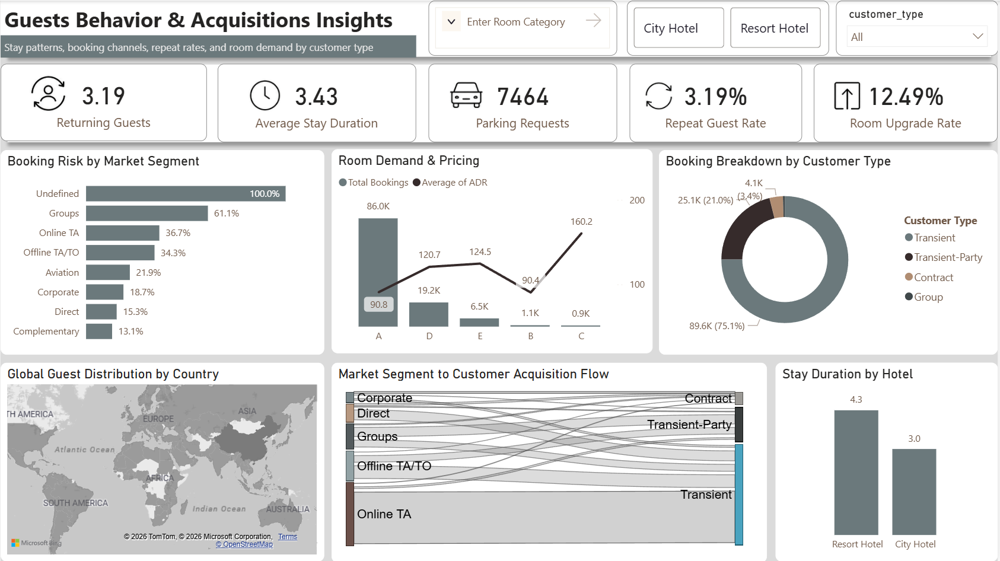
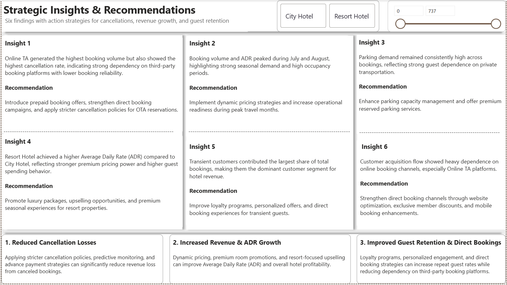

<p align="center">

</p>

<div align="center">

<a href="YOUR_DASHBOARD_LINK"></a>&nbsp;
<a href="Hotel Booking Cancellation Prediction Report.pdf"></a>&nbsp;
<a href="./sql/"></a>&nbsp;
<a href="EDA Report.pdf"></a>

<br/><br/>


</div>

<br/>

---

<div align="center">

## ` 119,400 Reservations · 37.0% Cancellation Rate · $101.83 ADR · 235K Guests `

</div>

---

<br/>

## ◈ What This Project Does

> **Transforms raw hotel reservation data into a full decision-grade intelligence system** — covering cancellation prediction, revenue yield analysis, guest acquisition behavior, and strategic recommendations — across City & Resort hotel properties.

Built across the **complete analytics lifecycle:**

```
Raw CSV Data  →  SQL Cleaning & Segmentation  →  Python EDA & ML Modeling
     →  Power BI (5 Dashboards)  →  PDF Executive Report  →  GitHub
```

<br/>

---

## ◈ Dashboard 01 — Hotel Performance Overview

> Bookings · Cancellations · ADR · Guest Volume · Monthly Trends · Market Treemap


<div align="center">

| Metric | Value |
|:--|:--|
| Total Reservations | **119,400** |
| Cancellation Rate | **37.0%** |
| City Hotel Volume | **79K bookings** |
| Resort Hotel Volume | **40K bookings** |
| Peak Month | **July–August** |

</div>

<br/>

---

## ◈ Dashboard 02 — Cancellation Risk & Loss Analysis

> Segment-Level Risk · Lead Time Impact · Monthly Trends · Predicted Risk Distribution



<div align="center">

| Metric | Value |
|:--|:--|
| Cancelled Reservations | **44,200** |
| Confirmed Reservations | **75,200** |
| Avg. Booking Lead Time | **104 days** |
| Returning Guest Cancellation | **14.5%** |
| Highest Risk Segment | **Groups — 61.06% ⚠️** |

</div>

<br/>

---

## ◈ Dashboard 03 — Pricing Behavior & Revenue Yield

> ADR by Hotel & Booking Status · Customer Value vs Cancellation · Monthly ADR by Type



<div align="center">

| Customer Type | Avg ADR | Cancellation Rate |
|:--|:--|:--|
| Transient | **$107.0** | 40.7% ⚠️ |
| Contract | **$87.5** | 31.0% |
| Transient-Party | **$86.1** | 25.4% |
| Group | **$83.5** | 10.2% ✅ |

</div>

<br/>

---

## ◈ Dashboard 04 — Guest Behavior & Acquisition Insights

> Stay Patterns · Booking Channels · Repeat Rates · Sankey Acquisition Flow · Global Map



<div align="center">

| Metric | Value |
|:--|:--|
| Returning Guests | **3.19** |
| Average Stay Duration | **3.43 nights** |
| Parking Requests | **7,464** |
| Repeat Guest Rate | **3.19%** |
| Room Upgrade Rate | **12.49%** |
| Transient Share | **75.1% of all bookings** |

</div>

<br/>

---

## ◈ Dashboard 05 — Strategic Insights & Recommendations

> 6 Data-Driven Findings · 3 Action Pillars · Filterable by City & Resort Hotel



<br/>

---

## ◈ Cancellation Risk Matrix

<div align="center">

| Segment | Contract | Group | Transient | Trans-Party | **Total** |
|:--|:--:|:--:|:--:|:--:|:--:|
| Aviation | — | 0.00% ✅ | 21.10% | 35.29% | 21.94% |
| Complementary | 0.00% ✅ | 0.00% ✅ | 13.23% | 12.50% | 13.06% ✅ |
| Corporate | 18.18% | 17.24% | 18.29% | 19.72% | 18.73% |
| Direct | 14.29% | 13.43% | 15.54% | 13.55% | 15.34% ✅ |
| **Groups** | **95.92% ⚠️** | 0.00% | **95.69% ⚠️** | 31.30% | **61.06% 🔴** |
| Offline TA/TO | 9.19% | 11.85% | 42.63% 🟡 | 26.15% | 34.32% 🟡 |
| **Online TA** | 25.84% | 6.15% | 38.80% 🟡 | 12.52% | **36.72% 🟡** |
| **TOTAL** | **30.96%** | **10.23%** | **40.75%** | **25.43%** | **37.04%** |

</div>

<br/>

---

## ◈ ML Model — Cancellation Predictor

```python
━━━━━━━━━━━━━━━━━━━━━━━━━━━━━━━━━━━━━━━━━━━━━━━━━━━━━━━━━━━━
  MODEL     Logistic Regression + Random Forest Ensemble
  TARGET    booking_status  →  Canceled / Confirmed
━━━━━━━━━━━━━━━━━━━━━━━━━━━━━━━━━━━━━━━━━━━━━━━━━━━━━━━━━━━━
  FEATURES  lead_time           market_segment      adr
            hotel_type          deposit_type        customer_type
            previous_cancels    booking_changes     special_requests
━━━━━━━━━━━━━━━━━━━━━━━━━━━━━━━━━━━━━━━━━━━━━━━━━━━━━━━━━━━━
  KEY DRIVER  →  lead_time  ×  market_segment  interaction
━━━━━━━━━━━━━━━━━━━━━━━━━━━━━━━━━━━━━━━━━━━━━━━━━━━━━━━━━━━━

  PREDICTED RISK DISTRIBUTION

  🟢 Low Risk     ████████████████████████████████  60.3%  →  72,000 bookings
  🟡 Medium Risk  ████████████████                  28.2%  →  33,600 bookings
  🔴 High Risk    ██████                            11.5%  →  13,700 bookings
━━━━━━━━━━━━━━━━━━━━━━━━━━━━━━━━━━━━━━━━━━━━━━━━━━━━━━━━━━━━
```

<br/>

---

## ◈ Strategic Action Pillars

```
┌─────────────────────────────┐ ┌─────────────────────────────┐ ┌─────────────────────────────┐
│  01 · REDUCE CANCELLATIONS  │ │  02 · GROW REVENUE & ADR    │ │  03 · RETAIN GUESTS         │
├─────────────────────────────┤ ├─────────────────────────────┤ ├─────────────────────────────┤
│ → Predictive risk flags     │ │ → Dynamic peak pricing      │ │ → Personalized loyalty tiers│
│ → OTA deposit mandates      │ │ → Resort luxury bundles     │ │ → Direct booking incentives │
│ → Lead time policies        │ │ → Yield management system   │ │ → Member-exclusive rates    │
│ → Group contract rules      │ │ → Upsell automation         │ │ → Mobile UX optimization    │
│ → Advance payment triggers  │ │ → Parking monetization      │ │ → Exclusive member offers   │
└─────────────────────────────┘ └─────────────────────────────┘ └─────────────────────────────┘
```

<br/>

---

## ◈ Technology Stack

<div align="center">

| Layer | Tools |
|:--|:--|
| **Data & Querying** |     |
| **Visualization & BI** |   |
| **Analytics & ML** |     |
| **Delivery** |   |

</div>

<br/>

---

## ◈ Repository Structure

```
📦 hotel_booking_cancellation_pridiction/
│
├── 📂 data/
│   ├── raw/                          → original hotel booking dataset
│   └── cleaned/                      → processed & feature-engineered dataset
│
├── 📂 sql/
│   ├── 01_cancellation_analysis.sql
│   ├── 02_adr_by_segment.sql
│   ├── 03_monthly_trends.sql
│   └── 04_guest_behavior.sql
│
├── 📂 python/
│   ├── 01_eda_exploration.ipynb
│   ├── 02_feature_engineering.ipynb
│   └── 03_cancellation_ml_model.ipynb
│
├── 📂 powerbi/
│   ├── hotel_performance_overview.pbix
│   ├── cancellation_risk_analysis.pbix
│   ├── pricing_revenue_yield.pbix
│   └── guest_behavior_acquisition.pbix
│
├── 📂 screenshots/
│   ├── hotel_overview.png
│   ├── cancellation.png
│   ├── ADR.png
│   ├── customers.png
│   └── strategies.png
│
├── 📂 report/
│   ├── hotel_intelligence_full_report.pdf
│   └── executive_summary.pdf
│
└── 📜 README.md
```

---

<div align="center">

<br/>

**Built for decision-grade analytics — not just dashboards.**

<br/>

<a href="www.linkedin.com/in/mohdfaij-data"></a>&nbsp;
<a href="https://mohdfaij-data.github.io"></a>

<br/><br/>

*If this project helped you, drop a ⭐ — it keeps the work going.*

<br/>

</div>


