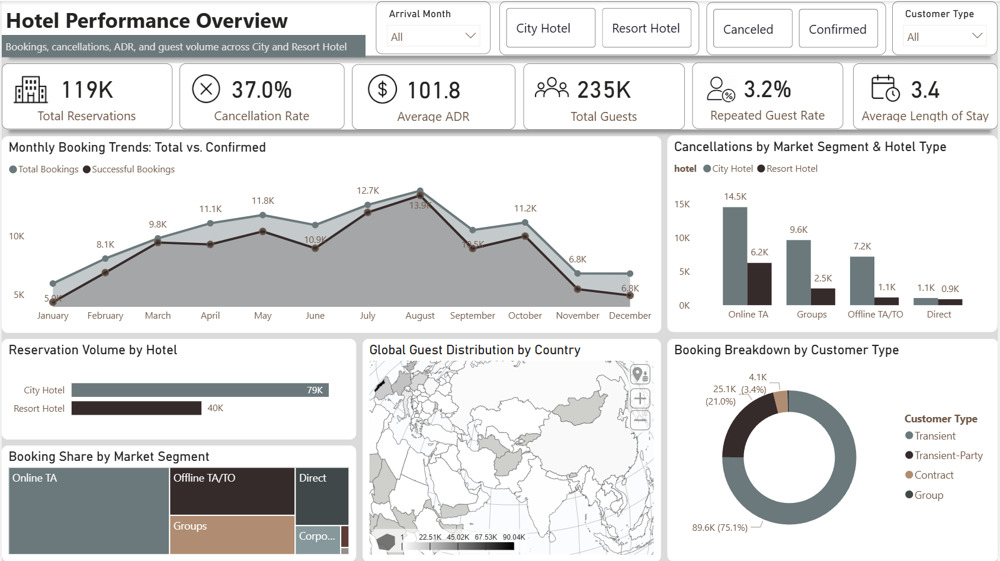
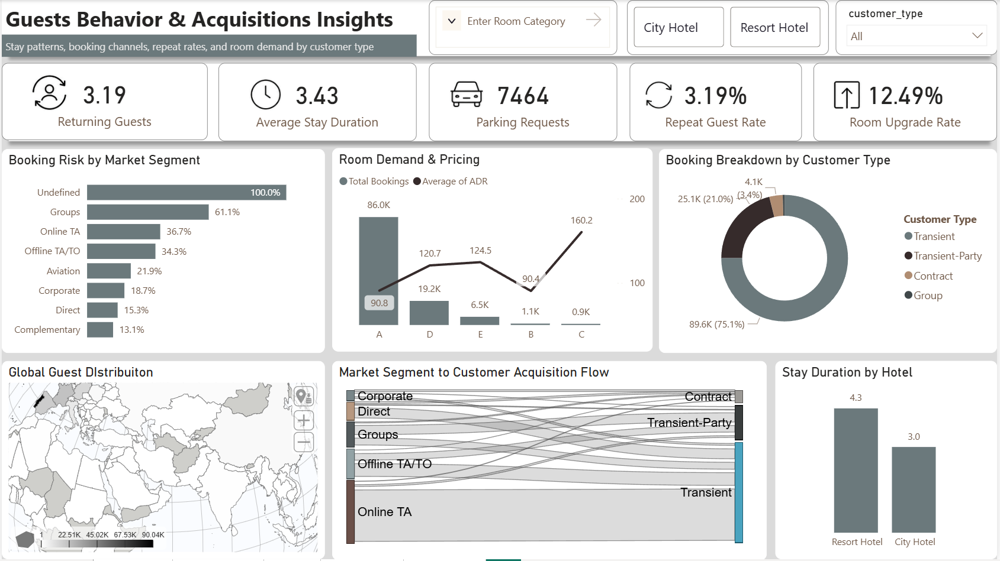

<div align="center">


</div>

<div align="center">

[](YOUR_DASHBOARD_LINK)
[](YOUR_REPORT_LINK)
[](./sql/)
[](./python/)

</div>

<br/>

<div align="center">

```
┌──────────────────────────────────────────────────────────────────────────┐
│   119,400 Reservations  ·  37% Cancellation Rate  ·  $101.83 ADR        │
│   235,000 Guests  ·  5 Power BI Dashboards  ·  6 Strategic Insights     │
└──────────────────────────────────────────────────────────────────────────┘
```

</div>

---

## 📋 Project Overview

> **A full-cycle hospitality analytics system** that predicts booking cancellations, uncovers revenue leakage, and delivers strategic intelligence across City & Resort hotel properties — transforming 119K raw reservations into decision-grade business intelligence.

This project spans the complete analytics lifecycle:
**Raw Data → SQL Transformation → Python ML Modeling → Power BI Dashboards → Executive Strategy Report**

---

## 📊 Dashboard Showcase

### 01 · Hotel Performance Overview
> Bookings · Cancellations · ADR · Guest Volume · Monthly Trends



---

### 02 · Cancellation Risk & Loss Analysis
> Segment-level Cancellation Rates · Lead Time Impact · Monthly Trends · Risk Distribution


---

### 03 · Pricing Behavior & Revenue Yield
> ADR by Hotel Type · Customer Segment · Booking Status · Stream Chart


---

### 04 · Guest Behavior & Acquisition Insights
> Stay Patterns · Booking Channels · Repeat Rates · Sankey Flow · Global Map



---

### 05 · Strategic Insights & Recommendations
> 6 Data-Driven Findings · 3 Action Pillars · City & Resort Filters


---

## 📈 Core Metrics Snapshot

| KPI | Value | Signal |
|-----|-------|--------|
| Total Reservations | **119,400** | Across both hotel types |
| Cancellation Rate | **37.0%** | ⚠️ High — primary risk factor |
| Average Daily Rate | **$101.83** | Resort Hotel commands premium |
| Total Guests | **235,000** | Transient = 75.1% dominant segment |
| Avg. Booking Lead Time | **104 days** | Direct impact on cancellation risk |
| Repeat Guest Rate | **3.2%** | Retention gap opportunity |
| Parking Demand | **7,464 requests** | Consistently high — unmonetized |
| Avg. Stay Duration | **3.43 nights** | Resort (4.3) vs City (3.0) |
| Room Upgrade Rate | **12.49%** | Upsell signal |
| Returning Guest Cancellation | **14.5%** | Lower risk in returning cohort |

---

## 🔍 Critical Findings

```
INSIGHT 01 ─────────────────────────────────────────────────────────────────
  Online TA = Highest Volume + Highest Cancellation Rate (36.7%)
  → OTA dependency creates structural revenue risk
  ACTION: Prepaid OTA offers · Stricter cancellation policies · Direct campaigns

INSIGHT 02 ─────────────────────────────────────────────────────────────────
  Peak Demand: July–August (ADR hits $160 in Room Type C)
  → Untapped yield management opportunity in peak months
  ACTION: Dynamic pricing + operational surge readiness

INSIGHT 03 ─────────────────────────────────────────────────────────────────
  Parking Requests Consistently High Across All Segments
  → Unmonetized high-demand amenity
  ACTION: Premium reserved parking · Capacity management system

INSIGHT 04 ─────────────────────────────────────────────────────────────────
  Resort Hotel ADR > City Hotel ADR
  → Stronger premium pricing power in resort segment
  ACTION: Luxury packages · Seasonal premium upsells · Experience bundles

INSIGHT 05 ─────────────────────────────────────────────────────────────────
  Transient Customers = 75.1% of All Bookings
  → Dominant segment with low loyalty investment
  ACTION: Personalized loyalty tiers · Direct booking incentives

INSIGHT 06 ─────────────────────────────────────────────────────────────────
  Groups Segment: 61% Cancellation Rate — Highest Risk Segment
  → Massive revenue leakage from group block cancellations
  ACTION: Deposit requirements · Group contract enforcement · Risk scoring
```

---

## ⚠️ Cancellation Risk Matrix

| Segment | Contract | Group | Transient | Transient-Party | **Total** |
|---------|----------|-------|-----------|-----------------|-----------|
| Aviation | — | 0.00% | 21.10% | 35.29% | 21.94% |
| Complementary | 0.00% | 0.00% | 13.23% | 12.50% | 13.06% |
| Corporate | 18.18% | 17.24% | 18.29% | 19.72% | 18.73% |
| Direct | 14.29% | 13.43% | 15.54% | 13.55% | 15.34% |
| **Groups** | 95.92% | 0.00% | 95.69% | 31.30% | **⚠️ 61.06%** |
| Offline TA/TO | 9.19% | 11.85% | 42.63% | 26.15% | 34.32% |
| **Online TA** | 25.84% | 6.15% | 38.80% | 12.52% | **⚠️ 36.72%** |
| **TOTAL** | 30.96% | 10.23% | 40.75% | 25.43% | **37.04%** |

---

## 🤖 ML Model — Cancellation Predictor

```python
# Cancellation Risk Classifier
Model     : Logistic Regression + Random Forest Ensemble
Target    : booking_status  →  Canceled / Confirmed
Features  : lead_time · market_segment · adr · hotel_type
            deposit_type · customer_type · previous_cancellations
            booking_changes · total_of_special_requests

Risk Output:
  Low Risk     ████████████████████████  60.3%  →  72,000 bookings
  Medium Risk  ████████████             28.2%  →  33,600 bookings
  High Risk    █████                    11.5%  →  13,700 bookings

Key Driver: lead_time × market_segment interaction
Use Case  : Flag high-risk bookings at reservation time
```

---

## 🎯 Strategic Action Pillars

<div align="center">

| 01 · Reduce Cancellation Losses | 02 · Grow Revenue & ADR | 03 · Retain Guests Directly |
|---|---|---|
| Predictive risk flags | Dynamic peak-season pricing | Personalized loyalty tiers |
| OTA deposit mandates | Resort luxury bundles | Transient direct booking offers |
| Lead time cancellation policies | Yield management system | Member-exclusive rates |
| Group contract enforcement | Room upsell automation | Website & mobile UX optimization |
| Advance payment triggers | Premium parking monetization | Exclusive member discounts |

</div>

---

## 🛠️ Technology Stack

**Data & Querying**
`SQL` · `PostgreSQL` · `DAX` · `Power Query (M)`

**Visualization & BI**
`Power BI` · `Power BI Service` · `Bookmarks & Drillthrough` · `Custom Tooltips`

**Analytics & ML**
`Python 3.10+` · `Pandas` · `Scikit-learn` · `Logistic Regression` · `Feature Engineering` · `Jupyter Notebook`

**Reporting & Delivery**
`PDF Report` · `Live Dashboard (Power BI Service)` · `GitHub` · `Executive Summary`

---

## 📁 Repository Structure

```
📦 hotel_booking_cancellation_pridiction/
│
├── 📂 data/
│   ├── raw/                         → original hotel booking dataset
│   └── cleaned/                     → processed, feature-engineered dataset
│
├── 📂 sql/
│   ├── 01_cancellation_analysis.sql
│   ├── 02_adr_by_segment.sql
│   ├── 03_monthly_trends.sql
│   └── 04_guest_behavior.sql
│
├── 📂 python/
│   ├── 01_eda_exploration.ipynb
│   ├── 02_feature_engineering.ipynb
│   └── 03_cancellation_ml_model.ipynb
│
├── 📂 powerbi/
│   ├── hotel_performance_overview.pbix
│   ├── cancellation_risk_analysis.pbix
│   ├── pricing_revenue_yield.pbix
│   └── guest_behavior_acquisition.pbix
│
├── 📂 screenshots/
│   ├── hotel_overview.png
│   ├── cancellation.png
│   ├── ADR.png
│   ├── customers.png
│   └── strategies.png
│
├── 📂 report/
│   ├── hotel_intelligence_full_report.pdf
│   └── executive_summary.pdf
│
└── 📜 README.md
```

---

<div align="center">

*Built for decision-grade analytics — not just dashboards.*

[](YOUR_LINKEDIN)
[](YOUR_PORTFOLIO)

*If this project helped you, consider giving it a ⭐*

</div>


